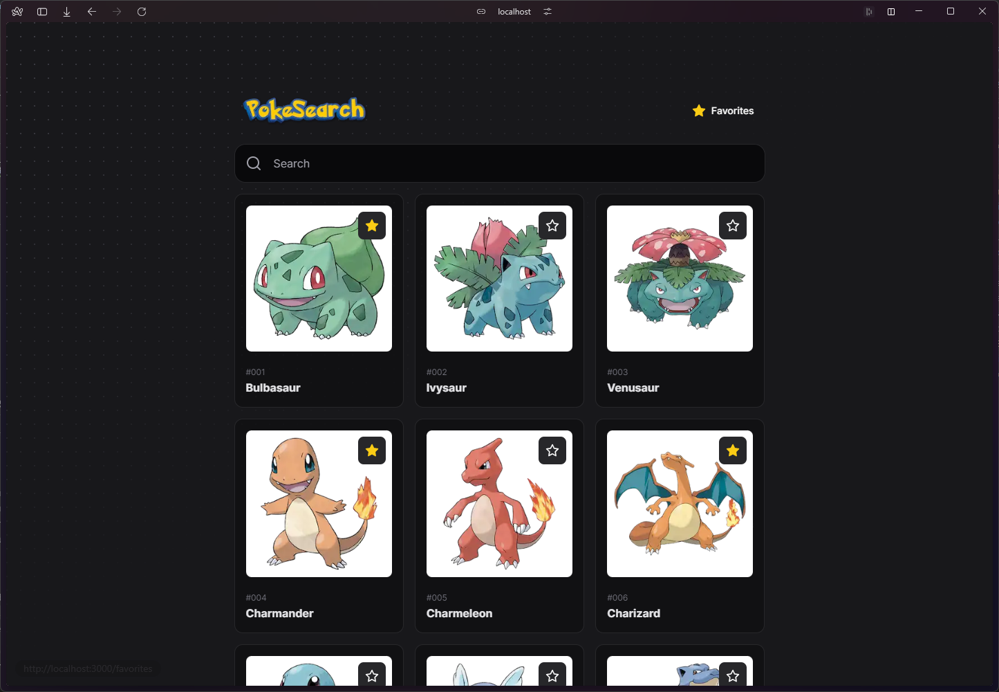
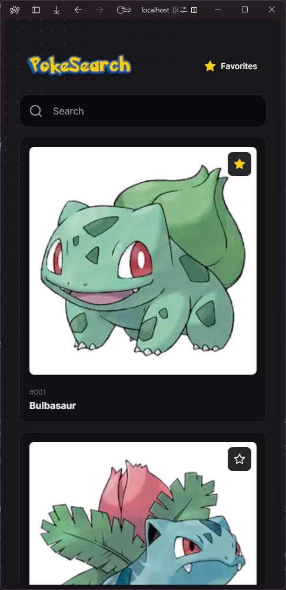
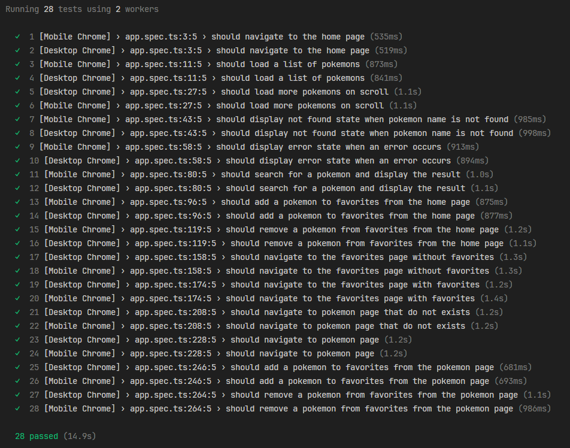

# PokeSearch

PokeSearch is a web application that allows users to search for Pokemons and their related information.

## [Demo link](https://pokesearch-react-app.vercel.app/)

|                                                      |                                                    |
| :--------------------------------------------------: | -------------------------------------------------- |
|  |  |

## Tech choices

- [Next.js](https://nextjs.org/)
- [TanStack Query](https://tanstack.com/query/latest/)
- [Zustand](https://github.com/pmndrs/zustand)
- [Shadcn UI](https://ui.shadcn.com)
- [Zod](https://zod.dev)
- [nuqs](https://github.com/47ng/nuqs/)
- [TailwindCSS](https://tailwindcss.com/)
- [Playwright](https://playwright.dev/)
- [Bun](https://bun.sh/)

## Architecture Overview

To be as close as possible to a real-world application, I have made architectural decisions similar to those I usually make, incorporating common practices and tools, but with slight differences.

### Framework and Routing

- **Next.js**: Next.js is a popular React framework that provides server-side rendering (SSR), static site generation (SSG), and a file-based routing system. It is widely adopted for production-level projects due to its comprehensive features, performance optimization, and developer experience.
- **App Router**: Next.js 13 introduced a new routing system called App Router, which simplifies the process of creating nested layouts and handling data fetching. The App Router uses a file-based routing approach, where each file in the app directory represents a route or a layout component.

### State Management

- **Zustand**: Utilized for global state management. Zustand offers a straightforward setup compared to Redux, making it the ideal choice. The primary use case in this project is to manage favorites, with the added functionality of persisting these favorites in `localStorage`.
  - The favorites store is implemented in `src/hooks/use-favorite-store.ts`.
- **nuqs**: Type-safe search params state manager for Next.js. It provides a simple and intuitive API for managing search params in Next.js applications.
  - It was used to manage the search input value, this is the only place where the search params are used.

### Data Fetching and Management

- **TanStack Query**: Used for API data fetching management, caching and mutations.
- **API Interactions**: TanStack Query is also used to perform mutations in the Zustand store.\
  I like to keep queries and mutations in a two separate files, for me it enhances maintainability.
  - Queries: `src/hooks/use-queries.ts`
  - Mutations: `src/hooks/use-mutations.ts`

### Type Safety and Validation

- **Zod**: Integral for type declaration and form validation, ensuring the codebase remains fully type-safe. Zod's integration facilitates robust validation schemes and enhances the project's reliability.

### Styling

- **TailwindCSS**: Adopted for its utility-first approach to CSS, allowing for rapid UI development without sacrificing customization.
- **Shadcn UI**: Serves as the component library, with modifications to fit the project's design requirements. The combination of TailwindCSS and Shadcn UI provides a flexible and efficient styling solution.

### Conclusion

The architectural decisions taken for this project are a synergy between the best development practices and the efficiency of the development process. The project uses tools and libraries that provide simplicity, type safety, and modularity to build a scalable and maintainable architecture that can be used in real-world applications.

## Getting started

```
bun install
bun run dev
```

## Testing

```
bun test:e2e
```


